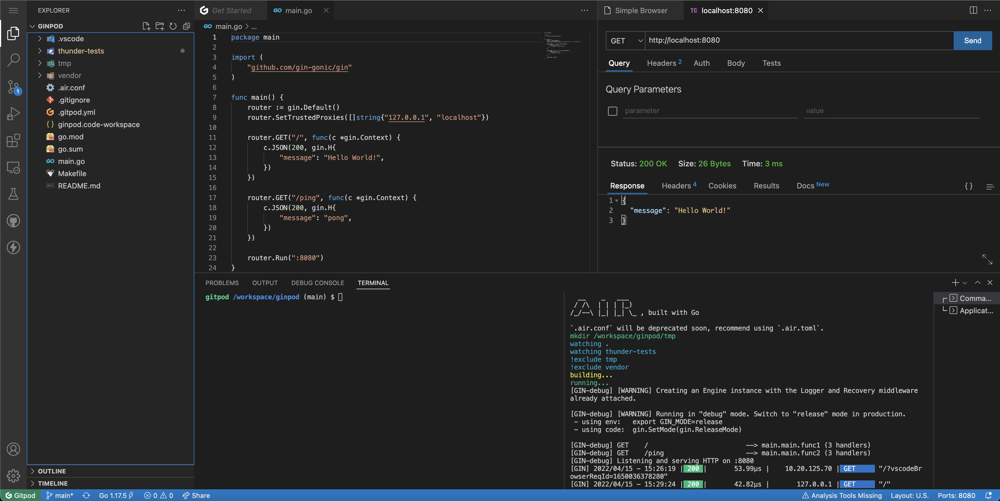

[](https://gitpod.io/#https://github.com/jefersonla/ginpod)

# Ginpod

A gin gitpod repository for easy development of web backend applications written in go

## Google Cloud Setup

Gcloud is already installed in this environment if you need.
To setup google cli proceed with the following commands:

```
gcloud auth login
gcloud config set project $PROJECT_ID
```

## Go important links

* go tour - https://go.dev/tour/welcome/1
* go by example - https://gobyexample.com/
* go playground - https://go.dev/play/
* go learn page - https://go.dev/learn/
* go documentation - https://go.dev/doc/

## Gitpod important links

* gp command - https://www.gitpod.io/docs/command-line-interface
* .gitpod.yml reference - https://www.gitpod.io/docs/references/gitpod-yml

## Applications & Libraries used

* Air https://github.com/cosmtrek/air - live reloading
* Gin https://github.com/gin-gonic/gin - web framework

## Extensions used

* golang.go - Go support
* vscode-icons-team.vscode-icons - VS Code icons theme
* rangav.vscode-thunder-client - HTTP Client (the lightning icon at your left)

